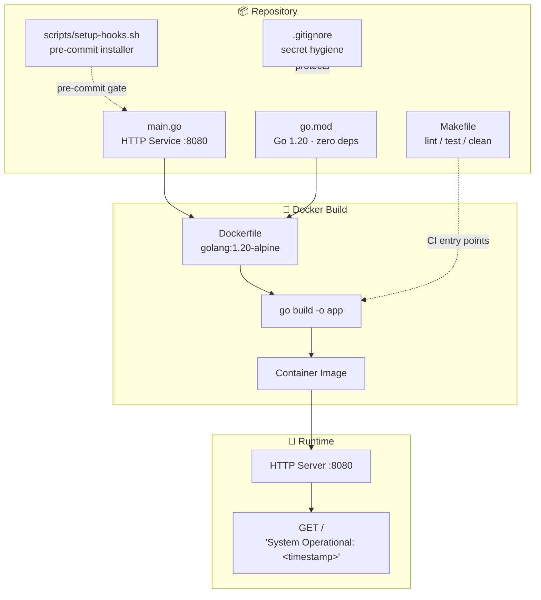
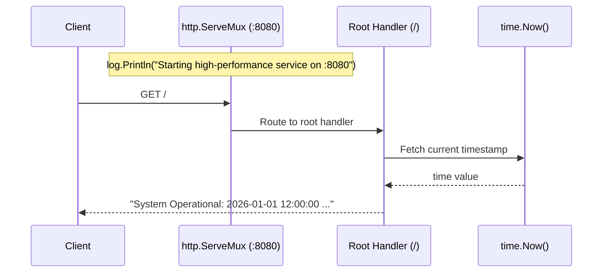

# cicd-github-actions-enterprise-pipeline


> **A Go-based reference service and CI/CD pipeline scaffold demonstrating an enterprise-style workflow with GitHub Actions conventions, Docker containerization, and pre-commit hygiene hooks.**

[](https://go.dev)
[](https://www.docker.com)
[](./LICENSE)
[]()

**Repository:** `github.com/Shivay00001/cicd-github-actions-enterprise-pipeline`
**Language:** Go 1.20 · **Runtime:** Docker (Alpine-based) · **Port:** `8080`

---

## 🚀 Overview

This repository contains a lightweight, self-contained Go HTTP service packaged as a Docker image, together with the supporting scaffolding — a Makefile task runner, git hook installer, and secret-hygiene `.gitignore` — that forms the foundation of an enterprise CI/CD pipeline. The service exposes a single HTTP endpoint that reports system liveness with a timestamp, making it an ideal **canary application** for validating a full pipeline flow: build → test → containerize → deploy.

## ✨ Features

- **⚡ Lightweight Go HTTP service** — standard library only (`net/http`, `log`, `fmt`, `time`); zero external dependencies for fast, hermetic, reproducible builds.
- **🐳 Docker-ready** — compiles the binary inside a `golang:1.20-alpine` container; no local Go toolchain required to run.
- **🔐 Secret hygiene** — a comprehensive `.gitignore` blocks `.env` files, API keys, service-account JSON, and credential files from being committed.
- **🪝 Git hooks bootstrap** — `scripts/setup-hooks.sh` installs a `pre-commit` hook into `.git/hooks/`.
- **🛠️ Makefile task runner** — standard `lint`, `test`, and `clean` targets serving as CI entry points.
- **📜 Custom commercial license** — free for non-commercial use; revenue-share and enterprise terms apply (see [License](#-license)).

## 🏗️ Architecture / How It Works

The repository is intentionally flat and consists of the following components:

```
.
├── main.go                  # The HTTP service (entry point)
├── go.mod                   # Go module definition (Go 1.20, no external deps)
├── Dockerfile               # Container build definition
├── Makefile                 # lint / test / clean task runner
├── scripts/
│   └── setup-hooks.sh       # Installs the pre-commit git hook
├── .gitignore               # Secret & build-artifact exclusion rules
└── LICENSE                  # VisionQuantech Custom Commercial License
```

### Component Architecture



### Request Flow (`main.go`)



1. On startup, `main()` registers a single handler on the root path `/` using Go's default `http.ServeMux`.
2. The handler writes `System Operational: <current timestamp>` to the response — functioning as a combined **health check / liveness probe**.
3. The server binds to **`:8080`** via `http.ListenAndServe`, logging startup and any fatal error through the standard `log` package.

Because there are no third-party imports, `go build` requires no module downloads, keeping CI builds hermetic and fast.

### Container Build (`Dockerfile`)

```dockerfile
FROM golang:1.20-alpine
WORKDIR /app
COPY . .
RUN go build -o app
CMD ["./app"]
```

The image copies the full repository context into `/app`, compiles a binary named `app`, and runs it as the container's entrypoint.

### Pipeline Hooks

- **`make lint` / `make test`** — standardized task-runner targets that act as the seams where linting and test execution are wired into CI.
- **`scripts/setup-hooks.sh`** — copies `scripts/pre-commit` into `.git/hooks/pre-commit` and marks it executable, enabling checks to run before every commit.

### CI/CD Flow

```mermaid
flowchart LR
    A["👨‍💻 git push"] --> B["🪝 pre-commit hook<br/>lint / format"]
    B --> C["⚙️ GitHub Actions<br/>make lint · make test"]
    C --> D["🔨 go build -o app"]
    D --> E["🐳 docker build"]
    E --> F["📦 Push Image<br/>to Registry"]
    F --> G["🚀 Deploy<br/>Port 8080"]

    style A fill:#1a1a2e,stroke:#00ADD8
    style G fill:#1a1a2e,stroke:#4caf50
```



## 🐳 Running with Docker (Any Laptop or Server)

This is the **recommended** way to run the service — no Go installation required.

### Option A: Standard Dockerfile

```bash
# 1. Clone the repository
git clone https://github.com/Shivay00001/cicd-github-actions-enterprise-pipeline.git
cd cicd-github-actions-enterprise-pipeline

# 2. Build the image
docker build -t cicd-enterprise-pipeline .

# 3. Run the container, mapping host port 8080 -> container port 8080
docker run -d -p 8080:8080 --name cicd-service cicd-enterprise-pipeline

# 4. Verify the service is live
curl http://localhost:8080
# Expected output: System Operational: 2026-01-01 12:00:00 ...
```

### Option B: Docker Compose

Create a `docker-compose.yml` in the repository root:

```yaml
services:
  app:
    build: .
    ports:
      - "8080:8080"
    restart: unless-stopped
```

Then run:

```bash
docker-compose up -d --build
```

### Stop / Clean Up

```bash
docker stop cicd-service && docker rm cicd-service
```

## 🛠️ Local Development

Requires **Go 1.20+**:

```bash
# Run directly
go run main.go

# Build a binary
go build -o app && ./app

# Pipeline tasks
make lint
make test

# Install git hooks
bash scripts/setup-hooks.sh
```

## 📄 License

**VisionQuantech Custom Commercial License** — Copyright (c) 2026 Shivay00001 / VisionQuantech.

| Use Case | Terms |
|---|---|
| 🎓 Non-commercial / educational | **Free** |
| 💰 Individual revenue-generating use | **15–30% gross revenue share** |
| 🏢 Business / enterprise use | **Separate commercial license required** — contact **visionquantech@proton.me** |

See [LICENSE](./LICENSE) for full terms. The software is provided **"AS IS"**, without warranty of any kind.

---

<p align="center">
  <i>Built with Go · Containerized with Docker · Licensed by VisionQuantech</i>
</p>